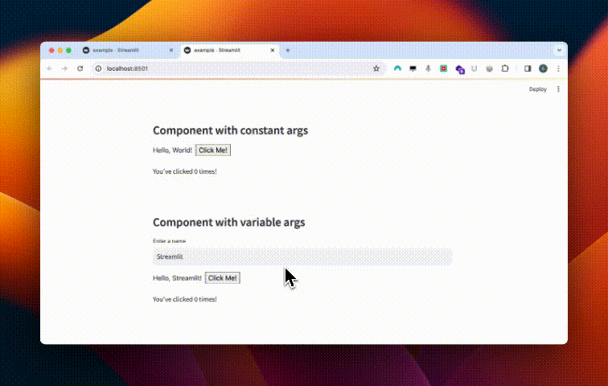

# streamlit-custom-component
This repository provides the necessary tools to create your own custom components for Streamlit.

## How to locally test your component on your laptop?

* First, generate a static HTML component from your React code:
```sh
cd st_helloworld
npm install
npm run build
```

* Next, execute the Streamlit application:
```sh
streamlit run example.py
```

## Demo

